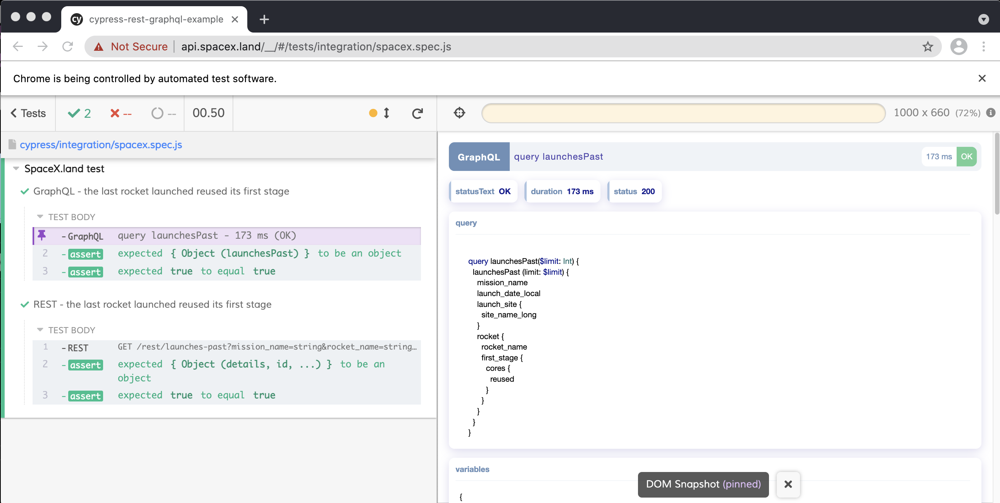

[![NPM dependencies][npm-dependencies-image]][npm-dependencies-url]
[![Last commit][last-commit-image]][last-commit-url] [![Last release][release-image]][release-url]

[![NPM downloads][npm-downloads-image]][npm-downloads-url] [![License][license-image]][license-url]

# Cypress REST & GraphQL

Simple plugin to add visual output and helper functions for performing REST and graphQL queries inside Cypress tests.


## Install

Add the plugin to `devDependencies`

```bash
npm i --save-dev cypress-rest-graphql
```

Inside `cypress/plugins/index.js`:

```javascript
module.exports = (on, config) => {
  require("cypress-rest-graphql/plugin")(on, config);
  return config;
};
```

At the top of `cypress/support/index.js`:

```javascript
import "cypress-rest-graphql";
```

You can now call the helpers and get nicely formatted output in the display pane




## Commands it provides

```javascript

/**
 * Helper to perform GraphQL queries on the API
 * Will display the query and response in the pane, for easy review.
 * Automatically uses cy.env('accessToken') for auth
 * @param  {graphQL} query - Query or Mutation graphQL
 * @param  {Object} variables - Key value pairs/object used as parameters to the query
 */
cy.graphql();

/**
 * Helper to periodically perform a graphQL query, checking the response against a condition.
 * 
 * @param  {graphQL} query - Query or Mutation graphQL
 * @param  {Object} variables - Key value pairs/object used as parameters to the query
 * @param  {Function} condition - Response data passed to this function, failed expects will trigger a loop. 
 * @param  {Number} wait=100 - Millisecond delay between polling
 * @param  {Number} maxTries=5 - Maximum number of retries before failing totally.
 */
cy.graphQLPolling()

/**
 * Wrapper to perform REST based API queries. Improved logging and review.
 * @param  {String} method='GET' - REST method to use
 * @param  {String} url - relative or absolute URL to hit
 * @param  {Object} postBody - Post body
 */
cy.rest()

/**
 * Helper to periodically perform a rest request, checking the response against a condition.
 * 
 * @param  {String} method='GET' - REST method to use
 * @param  {String} url - relative or absolute URL to hit
 * @param  {Object} postBody - Post body
 * @param  {Function} condition - Response data passed to this function, failed expects will trigger a loop. 
 * @param  {Number} wait=100 - Millisecond delay between polling
 * @param  {Number} maxTries=5 - Maximum number of retries before failing totally.
 */
cy.restPolling()
```

## See it in action for yourself

There is an sample repro (https://github.com/BrandedEntertainmentNetwork/cypress-rest-graphql-example) which uses the fantastic https://api.spacex.land to performing some simple tests to demonstrate the plugin in action.

## Assumptions

1. You are using standard graphQL url of `/graphql`
2. You use a bearer token for auth, and its stored as `Cypress.env('accessToken')` 

## Improvements todo
- [ ] Add polling examples
- [ ] Add support for https://allcontributors.org
- [ ] Add support for husky, eslint etc
- [ ] Convert to typescript
- [ ] Add unit testing
- [ ] More flexible URL system for graphQL queries
- [ ] Better error messages/failure display?
- [ ] More flexible auth options

## Gotchas

Due to https://github.com/cypress-io/cypress/issues/8948 we need to import legacy versions (locked) of webpack and other tools. This is so we can import CSS.

Probably a lot of others too. This has been built for a specific usecase we had, but thought others could find it useful - PRs are very welcome.

## Contributors

This project wants to follow the [all-contributors](https://github.com/all-contributors/all-contributors) specification. Contributions of any kind welcome!

## License

ISC, see [LICENSE](./LICENSE) for details.

[coveralls-image]: https://coveralls.io/repos/github/BrandedEntertainmentNetwork/cypress-rest-graphql/badge.svg
[coveralls-url]: https://coveralls.io/github/BrandedEntertainmentNetwork/cypress-rest-graphql
[build-image]: https://github.com/BrandedEntertainmentNetwork/cypress-rest-graphql/workflows/build/badge.svg?branch=main
[build-url]: https://github.com/BrandedEntertainmentNetwork/cypress-rest-graphql/actions?query=workflow%3Abuild+branch%3Amain
[last-commit-image]: https://img.shields.io/github/last-commit/BrandedEntertainmentNetwork/cypress-rest-graphql.svg
[last-commit-url]: https://github.com/BrandedEntertainmentNetwork/cypress-rest-graphql/commits
[license-image]: https://img.shields.io/npm/l/cypress-rest-graphql.svg
[license-url]: https://github.com/BrandedEntertainmentNetwork/cypress-rest-graphql/blob/main/LICENSE
[npm-downloads-image]: https://img.shields.io/npm/dm/cypress-rest-graphql.svg
[npm-downloads-url]: https://www.npmjs.com/package/cypress-rest-graphql
[npm-dependencies-image]: https://img.shields.io/david/BrandedEntertainmentNetwork/cypress-rest-graphql.svg
[npm-dependencies-url]: https://david-dm.org/BrandedEntertainmentNetwork/cypress-rest-graphql
[quality-gate-image]: https://sonarcloud.io/api/project_badges/measure?project=cypress-rest-graphql&metric=alert_status
[quality-gate-url]: https://sonarcloud.io/dashboard?id=cypress-rest-graphql
[release-image]: https://img.shields.io/github/release-date/BrandedEntertainmentNetwork/cypress-rest-graphql.svg
[release-url]: https://github.com/BrandedEntertainmentNetwork/cypress-rest-graphql/releases
